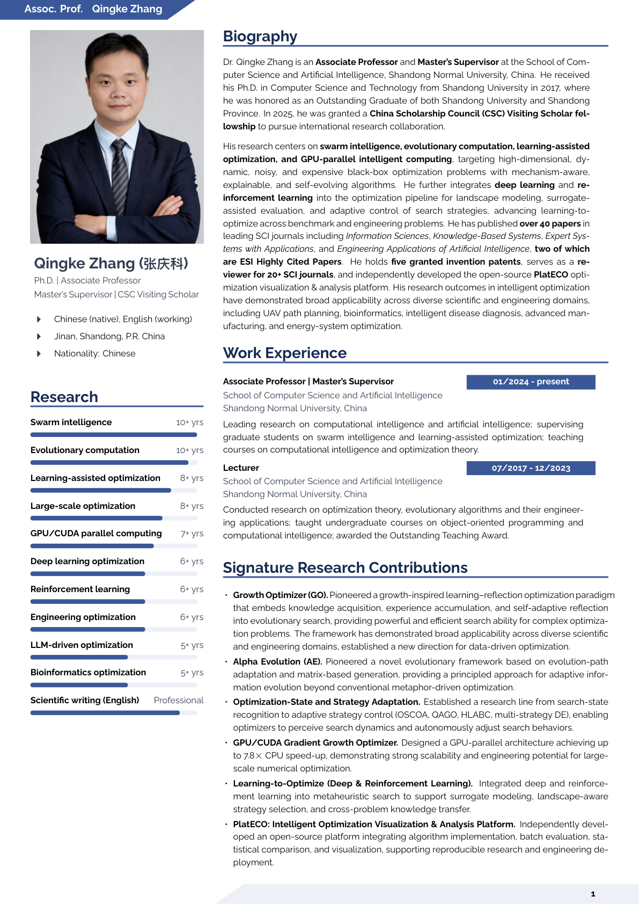

# Qingke Zhang · Academic Homepage

**张庆科 · 个人学术主页** — 山东师范大学计算机与人工智能学院副教授，研究方向：群体智能、演化计算与并行智能计算。

[](https://tsingke.github.io)
[](https://jekyllrb.com)
[](https://pages.github.com)
[](assets/css/main.css)
[](LICENSE)

> A professional, bilingual academic homepage — **data-driven** so content updates never require touching layout or styles.
> 专业的双语学术主页——**数据驱动**，更新内容无需改动布局与样式。

---

## 📸 预览 Preview

**英文简历 English CV** — 完整学术履历（可在 /cv/ 页下载 PDF）



**英文首页 Homepage (English)** — 深蓝紫渐变 Hero · 左矩形照片 + 右个人信息 · 精选论文图文卡


---

## ✨ 功能特性 Features

- 🌐 **中英双语切换** — 一键切换界面文案与正文（`_data/i18n.yml` + 双语数据块），记忆语言偏好
- 🌙 **黑白模式** — 月亮/太阳按钮切换，默认跟随系统，记忆偏好
- 📄 **论文模块** — 按引用数/时间/类型排序，PDF 下载 · 源代码 · 在线阅读 · BibTeX 引用四按钮，详情页含中英摘要/关键词/截图
- 🎓 **课程资料站** — 每门课含课程介绍、教材、授课目录、章节课件、课程代码、视频、参考资料（中英双语）
- 👥 **团队与实验室** — 在读/毕业生卡片（点击弹窗看详情）、本科生培养、研究方向、科研项目、专利、实验室地址
- 📢 **招生模块** — 招生流程流线、培养理念、研究方向、学生发展、软硬件资源、导师寄语
- 📧 **联系方式** — 分组卡片 + 一键复制 + 高德地图定位
- 🔄 **数据驱动维护** — 改数据文件即更新，布局/样式/JS 永不改动

---

## 🛠 技术栈 Tech Stack

| 技术 | 说明 |
|---|---|
| **Jekyll 3.10** | 静态站点生成器（GitHub Pages 云端构建） |
| **纯 CSS** | `tokens.css`（设计变量）+ `main.css`（组件样式），零编译依赖 |
| **Vanilla JS** | 语言/主题切换、论文排序、复制、弹窗、滚动动画 |
| **Inline SVG** | 全站图标 sprite（50+ 图标） |
| **GitHub Pages** | 免费托管，`git push` 自动部署 |

---

## 📁 项目结构 Project Structure

```
tsingke.github.io/
├─ _pages/            # 页面（home / publications / teaching / lab / recruiting / cv / contact）
├─ _publications/     # 论文（每篇一个 md，含中英摘要/BibTeX/PDF/截图）
├─ _teaching/         # 课程（每门课一个 md，含课程资料）
├─ _data/             # 数据层（i18n 文案 / members 团队 / lab 实验室 / contact 联系 / news 新闻 / students 成果）
├─ _layouts/          # 布局（default/home/page/archive/single/publication/course）
├─ _includes/         # 组件（nav / hero / card / icons / pub-actions 等）
├─ assets/
│  ├─ css/            # tokens.css（设计变量）+ main.css（样式）
│  └─ js/app.js       # 交互逻辑
├─ images/            # 头像、论文截图、favicon、README 截图
├─ files/             # 简历 PDF、论文 PDF
└─ _config.yml        # 站点配置（作者信息、URL、集合）
```

---

## 🚀 快速开始 Quick Start

### 本地预览（可选）

```bash
cd tsingke.github.io
bundle install
bundle exec jekyll serve -l -H localhost --config _config.yml,_config_docker.yml
# 打开 http://localhost:4000
```

或使用 Docker：`docker compose up`（Ruby 3.2 环境，内置）。

> 日常更新**无需本地预览**——直接改数据文件推送即可，GitHub Actions + Pages 自动构建校验。

---

## 📝 如何更新 How to Update

| 更新内容 | 操作文件 |
|---|---|
| ➕ 加一篇论文 | `_publications/` 新建 md（照抄现有 frontmatter 模板） |
| ➕ 加一门课程 | `_teaching/` 新建 md |
| 👥 团队成员 | `_data/members.yml`（在读/毕业生/本科生） |
| 📰 新闻动态 | `_data/news.yml` 顶部追加 |
| 🔬 研究方向/项目/专利 | `_data/lab.yml` |
| 📧 联系方式 | `_data/contact.yml` |
| 🏆 培养成果 | `_data/students.yml` |
| 📄 简历 PDF | 覆盖 `files/main-en.pdf` / `main-zh.pdf` |
| 🧭 导航栏 | `_data/navigation.yml` |
| 🌐 中英文案 | `_data/i18n.yml`（en/zh 两套） |

> 📖 完整的后台更新操作手册（含每个模块的字段示例）已存档于个人 Obsidian 智能笔记库「tsingke.github.io-网站后台更新指南.md」，需要时可由 Claude Code 调取。

---

## 🔄 部署流程 Deployment

```bash
cd tsingke.github.io
git add -A
git commit -m "更新说明"
git push origin main
```

推送后 1~2 分钟，GitHub Actions（`jekyll build --strict_front_matter`）校验 + Pages 自动构建上线。CSS/JS 带构建时间戳版本号，自动防缓存。

---

## 🌐 中英双语 & 🌙 黑暗模式

- **双语**：数据文件含 `title_zh/text_zh` 中文字段，页面用 `i18n-en/i18n-zh` 双语文块；切中文时界面+正文同步中文
- **黑暗模式**：导航月亮/太阳按钮，默认跟随系统，`localStorage` 记忆

---

## 📄 许可证 License

[](LICENSE)

站点基于 [academicpages](https://github.com/academicpages/academicpages.github.io) 模板重构，MIT License。

---

## 👤 作者 Author

**Qingke Zhang（张庆科）** — Ph.D., Associate Professor

- 🌐 [tsingke.github.io](https://tsingke.github.io)
- 📧 [tsingke@sdnu.edu.cn](mailto:tsingke@sdnu.edu.cn)
- 🐙 [github.com/tsingke](https://github.com/tsingke)
- 🆔 [ORCID 0000-0003-3960-172X](https://orcid.org/0000-0003-3960-172X)
